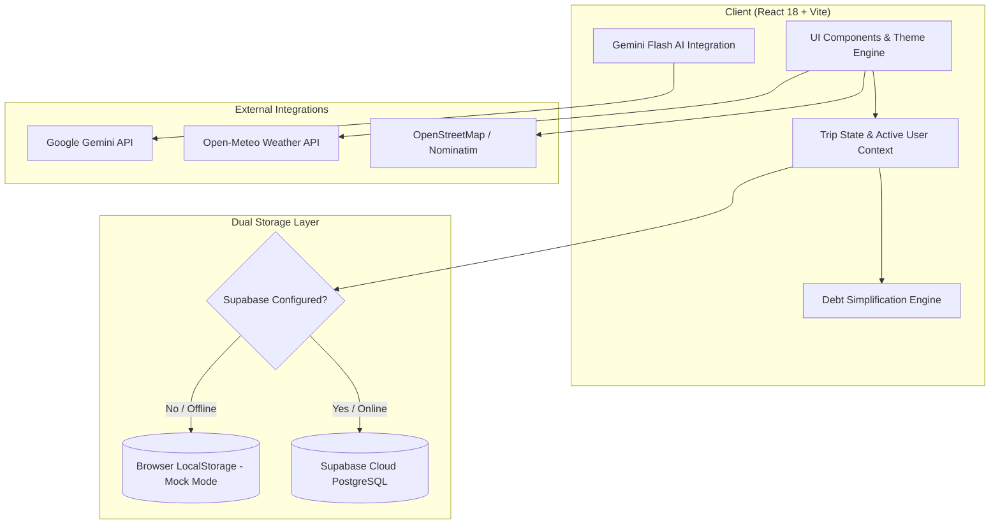

<div align="center">
  
  
  # ✈️ Wandr
  ### The Ultimate Collaborative Group Travel & Expense Management Platform

  <p align="center">
    <strong>Plan itineraries, track group expenses, settle debts automatically, store travel documents, and get real-time AI travel insights — all in one breathtaking interface.</strong>
  </p>

  <p align="center">
    <a href="https://sourishnandy4-cell.github.io/Wandr/"></a>
    
    
    
    
    
    
  </p>

  <p align="center">
    <a href="#-overview">Overview</a> •
    <a href="#-key-features">Key Features</a> •
    <a href="#-visual-tour--screenshots">Screenshots</a> •
    <a href="#-system-architecture">Architecture</a> •
    <a href="#-quick-start">Quick Start</a> •
    <a href="#-database--supabase-setup">Database Setup</a> •
    <a href="#-gemini-ai-configuration">AI Setup</a> •
    <a href="#-themes--customization">Themes</a> •
    <a href="#-tech-stack">Tech Stack</a> •
    <a href="#-troubleshooting--faq">FAQ</a>
  </p>
</div>

---

## 🌟 Overview

**Wandr** is a state-of-the-art group travel application crafted for modern adventurers, friends, and families. Planning group trips is often chaotic — juggling multiple spreadsheets, splitting restaurant bills, keeping track of PDF flight tickets, and figuring out daily itineraries across disjointed messaging apps.

Wandr consolidates everything into a single, lightning-fast dashboard:
- 🗺️ **Comprehensive Itinerary Timeline** with time-based slots and location pin mapping.
- 💸 **Smart Multi-Payer Expense Tracker** with automatic graph-based debt simplification.
- 🗃️ **Secure Travel Document Vault** for booking confirmations, flight tickets, and hotel vouchers.
- 🤖 **Google Gemini AI Assistant** trained as your personal financial advisor and itinerary curator.
- 📍 **Interactive Maps & Live Location Hub** for group meeting points and trip navigation.
- 🌦️ **Live Weather Forecasts & Packing Suggestions** for your exact destination.
- ⚡ **Zero-Barrier Dual Architecture**: works out of the box with offline `localStorage` mock data or connects to **Supabase Cloud** for real-time multiplayer synchronization.

---

## ✨ Key Features

```
                                  WANDR CAPABILITIES
  ┌───────────────────────┬───────────────────────┬───────────────────────┐
  │   🗓️ ITINERARY & MAP   │   💰 EXPENSES & DEBT  │   🧳 TRAVEL VAULT     │
  │  • Day-by-Day Blocks  │  • Multi-Member Split │  • Flight / Hotel Docs│
  │  • Category Tagging   │  • Debt Simplification│  • PDF & URL Storage  │
  │  • Interactive Map Pin│  • Recharts Visuals   │  • Fast Categorization│
  ├───────────────────────┼───────────────────────┼───────────────────────┤
  │   🤖 GEMINI AI ADVISOR │   🌦️ WEATHER & PACK   │   🎨 6 VIBRANT THEMES │
  │  • Contextual Insights│  • 5-Day Live Forecast│  • Neon, Cosy, Sakura │
  │  • Budget Health Check│  • Dynamic Pack Guide │  • Retro, Island, Dark│
  │  • Instant Suggestions│  • Destination Temp   │  • Instant Switching  │
  └───────────────────────┴───────────────────────┴───────────────────────┘
```

### 1. 📊 Unified Dashboard & Trip Analytics
- **Live Trip Countdown**: Displays days remaining or active day counter.
- **Budget Health Overview**: Real-time progress bars and interactive Recharts pie charts breaking down expenses by category (Food, Flights, Lodging, Activities, Transport).
- **Recent Activity Feed**: Instant updates on the latest expenses, itinerary changes, and member actions.
- **Dynamic Destination Cover**: Automatically retrieves high-resolution destination photos matching your trip city.

### 2. 🗓️ Interactive Itinerary Planner
- **Day-by-Day Scheduling**: Organize activities across morning, afternoon, evening, and night slots.
- **Categorized Badges**: Flight, Hotel, Dining, Sightseeing, Transport, Activity, and Relaxation.
- **Estimated Costs & Locations**: Add venue names, addresses, and budget estimates to each itinerary item.
- **Map Synchronization**: Automatically syncs itinerary venues with the built-in Map View.

### 3. 💸 Smart Expense Tracker & Debt Settlement
- **Flexible Splitting**: Split bills equally or assign custom amounts and percentages to specific members.
- **Automated Debt Simplification**: Built-in graph-reduction algorithm minimizes the total number of transactions required to settle balances (who owes whom and exactly how much).
- **1-Click Settlement**: Track payments and mark balances as settled once repaid.
- **Multi-Currency Ready**: Track total trip expenditure in your group's chosen currency.

### 4. 🤖 Google Gemini AI Travel & Finance Companion
- **Real-Time Context Ingestion**: The AI agent reads your live itinerary, active budget, and logged expenses.
- **Smart Advisory Modes**:
  - 💡 *Budget Optimization*: Identify where your group is overspending.
  - 🎒 *Packing Recommendations*: Tailored packing list based on destination weather and scheduled activities.
  - 🍽️ *Local Dining Suggestions*: Find authentic food spots matching your itinerary stops.
  - 🗺️ *Itinerary Gap Filling*: Discover hidden gems to fill free afternoon slots.
- **Client-Side Privacy**: Custom API keys are stored safely in local browser storage.

### 5. 📁 Travel Document Vault
- **Centralized Hub**: Store flight tickets, hotel reservations, train bookings, visa documents, and travel insurance.
- **Multi-format Support**: Save direct web confirmation URLs, reference codes, or upload PDF / image files.
- **Search & Filter**: Filter documents by category, date, or member.

### 6. 🗺️ Interactive Maps & Live Location Hub
- **Place Pinning**: View all itinerary stops plotted on an interactive map.
- **Meeting Points**: Set landmark meeting spots for the group with coordinate tags.
- **Live Geolocation Support**: Check your current location relative to your next itinerary event.

### 7. 🌦️ Weather Forecast & Packing Radar
- **Live Weather API**: Fetches current weather and forecast predictions for the trip location.
- **Packing Suggestions**: Dynamic recommendations based on forecasted temperature, rain probability, and UV index.

### 8. 🎨 6 Hand-Crafted Design Themes
Seamlessly toggle between 6 color palettes designed with custom CSS tokens:
- ⚡ **Neon**: Cyberpunk dark mode with electric cyan and magenta glows.
- 🕯️ **Cosy**: Warm cabin aesthetics with soft earthy pastels.
- 🌸 **Sakura**: Cherry blossom pastels and warm minimalist wood accents.
- 📻 **Retro**: 80s warm nostalgia with bold mustard, terracotta, and olive.
- 🏝️ **Island**: Tropical paradise freshness with lagoon teal and coral accents.
- 🌑 **Eclipse**: High-contrast slate-dark mode for maximum night-time readability.

---

## 📸 Visual Tour & Screenshots

<div align="center">
  
  <p><em>Dashboard overview with itinerary timeline, budget analytics, and balance sheet.</em></p>
  
  
  <p><em>Interactive expense logger and categorized travel schedule.</em></p>
</div>

---

## 🏛️ System Architecture



---

## 🚀 Quick Start

### Prerequisites
- **Node.js**: `v18.0.0` or higher
- **npm** or **yarn** / **pnpm**

### 1. Clone the Repository
```bash
git clone https://github.com/sourishnandy4-cell/Wandr.git
cd Wandr
```

### 2. Install Dependencies
```bash
npm install
```

### 3. (Optional) Configure Environment Variables
If you want to connect to a live Supabase backend, create a `.env` file:
```bash
cp .env.example .env
```
Fill in your Supabase credentials:
```env
VITE_SUPABASE_URL=https://your-project-id.supabase.co
VITE_SUPABASE_ANON_KEY=your-supabase-anon-key
```

> [!NOTE]
> **No Supabase account?** Skip step 3! Wandr automatically detects missing credentials and launches in **Zero-Config Offline Mock Mode** with preloaded Barcelona trip demo data.

### 4. Run Development Server
```bash
npm run dev
```
Open [http://localhost:3000](http://localhost:3000) (or the port displayed in your terminal) in your browser.

### 5. Build for Production
```bash
npm run build
npm run preview
```

---

## 🗄️ Database & Supabase Setup

To enable real-time multi-user synchronization and collaborative trip sharing:

### 1. Create a Supabase Project
1. Sign up or log in to [supabase.com](https://supabase.com).
2. Click **New Project** and choose a project name and database password.

### 2. Run Database Migrations
Open the **SQL Editor** in your Supabase dashboard and execute the SQL scripts in this exact order:

1. **`database/schema.sql`**: Creates tables for `trips`, `trip_members`, `itinerary_items`, `expenses`, `expense_splits`, `documents`, and `users`.
2. **`database/rls_policies.sql`**: Configures Row-Level Security policies to protect private trip data.
3. **`database/seed.sql`** *(Optional)*: Populates demo trips and itinerary data for Barcelona.

### 3. Add GitHub Actions Deployment Secrets (for GitHub Pages)
If deploying via GitHub Actions:
1. Navigate to **GitHub Repository → Settings → Secrets and variables → Actions**.
2. Add repository secrets:
   - `VITE_SUPABASE_URL`: Your Supabase Project URL.
   - `VITE_SUPABASE_ANON_KEY`: Your Supabase Anon Key.
3. In **Settings → Pages**, set the source to `gh-pages` branch.

---

## 🤖 Gemini AI Configuration

Wandr integrates with Google Gemini Flash for lightning-fast, cost-effective travel advice.

1. Obtain a free API key at [Google AI Studio](https://aistudio.google.com).
2. Open Wandr in your browser and click on the **Finance AI** or **AI Assistant** tab.
3. Open the **AI Settings** gear icon and paste your API key.
4. Your API key is safely stored locally in your browser (`localStorage`) and is never sent to external servers.

---

## 🎨 Themes & Customization

Wandr features an intuitive Theme Engine. You can switch themes at any time from the header dropdown:

| Theme | Icon | Palette Preview | Vibe |
|---|:---:|:---|---|
| **Neon** | ⚡ | `#0f0c29` • `#00f0ff` • `#ff00aa` • `#4A90D9` | High-energy cyberpunk dark mode |
| **Cosy** | 🕯️ | `#faf5f0` • `#d4736e` • `#87a96b` • `#7c6f64` | Warm cabin, soft pastels, relaxing |
| **Sakura** | 🌸 | `#fff0f3` • `#ff8da1` • `#ff5c7a` • `#8a2846` | Tokyo in spring, cherry blossoms |
| **Retro** | 📻 | `#fdf6e3` • `#e8692d` • `#6b8e23` • `#d4a017` | 80s warm typography & earthy tones |
| **Island** | 🏝️ | `#e0f7fa` • `#0077b6` • `#ff6b6b` • `#2d6a4f` | Tropical breeze, turquoise lagoons |
| **Eclipse** | 🌑 | `#0b0f19` • `#1e293b` • `#6366f1` • `#3b82f6` | Sleek slate midnight, clean focus |

---

## 🧰 Tech Stack

| Domain | Technology | Description |
|---|---|---|
| **Frontend Framework** | [React 18](https://react.dev/) | Modern component-driven UI with Hooks |
| **Build Tool** | [Vite 5](https://vitejs.dev/) | Ultra-fast HMR and optimized asset bundling |
| **Styling** | [Tailwind CSS 3](https://tailwindcss.com/) | Custom theme tokens, responsive utilities |
| **Icons** | [Lucide React](https://lucide.dev/) | Crisp, modern SVG iconography |
| **Data Visualizations** | [Recharts](https://recharts.org/) | Responsive SVG charts for budget breakdown |
| **Backend & Auth** | [Supabase](https://supabase.com/) | PostgreSQL, Row-Level Security & Real-time API |
| **AI Engine** | [Google Gemini Flash](https://ai.google.dev/) | Contextual travel recommendations & budget advisor |
| **Deployment** | [GitHub Pages](https://pages.github.com/) | Automated CI/CD via GitHub Actions |

---

## 📁 Project Structure

```
Wandr/
├── .github/
│   └── workflows/
│       └── deploy.yml          # GitHub Pages automated deployment pipeline
├── database/
│   ├── schema.sql              # Supabase table definitions & constraints
│   ├── rls_policies.sql        # Row-level security rules
│   └── seed.sql                # Barcelona demo dataset
├── public/
│   └── wandr-icon.svg          # Official Wandr vector brand logo
├── src/
│   ├── components/             # Modular React UI components
│   │   ├── AIAssistant.jsx     # Gemini AI chat interface & recommendation cards
│   │   ├── AISettings.jsx      # API key management & prompt configuration
│   │   ├── AddFriendsModal.jsx # Group invite link generator
│   │   ├── BalanceSheet.jsx    # Debt simplification & settlement cards
│   │   ├── BudgetPieChart.jsx  # Recharts budget visualization
│   │   ├── CursorPlane.jsx     # Ambient cursor flight animation
│   │   ├── Header.jsx          # Top navigation, theme toggle & trip selector
│   │   ├── ItineraryTimeline.jsx # Day-by-day activity scheduler
│   │   ├── LiveLocation.jsx    # Geolocation & group meeting points
│   │   ├── LoadingScreen.jsx   # Premium branded splash screen
│   │   ├── Login.jsx           # Multi-user login & demo profiles
│   │   ├── MapView.jsx         # Interactive itinerary pin maps
│   │   ├── ProfileModal.jsx    # User settings & home currency
│   │   ├── RecentExpenses.jsx  # Expense logger & split manager
│   │   ├── Sidebar.jsx         # Navigation sidebar
│   │   ├── ThemeToggle.jsx     # 6-theme switching component
│   │   ├── TravelDocs.jsx      # Document vault & booking storage
│   │   ├── TripMembers.jsx     # Trip members & role badges
│   │   └── WeatherView.jsx     # Weather forecasts & packing insights
│   ├── contexts/
│   │   └── ThemeContext.jsx    # Theme provider & persistence
│   ├── lib/
│   │   ├── authService.js      # Auth & profile management
│   │   ├── balanceCalculator.js# Debt simplification graph algorithm
│   │   ├── expenseService.js   # Expense calculation & splitting logic
│   │   ├── itineraryService.js # Itinerary CRUD operations
│   │   ├── mockDatabase.js     # Zero-config localStorage storage engine
│   │   ├── supabaseClient.js   # Supabase client & fallback detector
│   │   └── useCloudSync.js     # Real-time state synchronization hook
│   ├── App.jsx                 # Main application controller & router
│   ├── index.css               # Global theme tokens & animations
│   └── main.jsx                # Application entry point
├── package.json
├── tailwind.config.js
└── vite.config.js
```

---

## ❓ Troubleshooting & FAQ

<details>
<summary><strong>Q: Why does the app say "Running in Mock Mode"?</strong></summary>

> **A:** If no Supabase credentials (`VITE_SUPABASE_URL` and `VITE_SUPABASE_ANON_KEY`) are present in `.env`, Wandr gracefully falls back to local browser storage. All features (itinerary planning, expense tracking, AI advice) work completely offline for single-user testing.
</details>

<details>
<summary><strong>Q: How does debt simplification work?</strong></summary>

> **A:** When multiple group members pay for various items, calculating pairwise balances can require dozens of transactions. Wandr calculates each person's net balance (total paid minus total owed) and uses a greedy debt settlement algorithm to minimize the total transactions required to bring everyone back to zero.
</details>

<details>
<summary><strong>Q: Is my Gemini API key secure?</strong></summary>

> **A:** Yes. Your Google Gemini API key is stored exclusively in your browser's `localStorage` and is used solely for direct client-side requests to Google's official Gemini endpoint. It is never logged or transmitted to any third-party server.
</details>

---

## 🤝 Contributing

Contributions, feature ideas, and pull requests are warmly welcome!

1. Fork the Project (`https://github.com/sourishnandy4-cell/Wandr/fork`)
2. Create your Feature Branch:
   ```bash
   git checkout -b feature/AmazingFeature
   ```
3. Commit your Changes:
   ```bash
   git commit -m "feat: Add AmazingFeature"
   ```
4. Push to the Branch:
   ```bash
   git push origin feature/AmazingFeature
   ```
5. Open a **Pull Request**.

---

## 📄 License

Distributed under the **MIT License**. See `LICENSE` for more information.

---

## 💖 Acknowledgements

- Built with ❤️ for group travelers worldwide.
- [Google Antigravity](https://antigravity.google) & [Google DeepMind](https://deepmind.google)
- [Lucide Icons](https://lucide.dev/) for the icon library.
- [Google Gemini](https://ai.google.dev/) for intelligent travel insights.
- [Supabase](https://supabase.com/) for PostgreSQL backend & auth.
- [Recharts](https://recharts.org/) for data visualizations.
- [satiricalguru](https://github.com/satiricalguru) & [sourishnandy4-cell](https://github.com/sourishnandy4-cell).

<div align="center">
  <sub>Made with ✈️ and wanderlust by the Wandr Team</sub>
</div>
